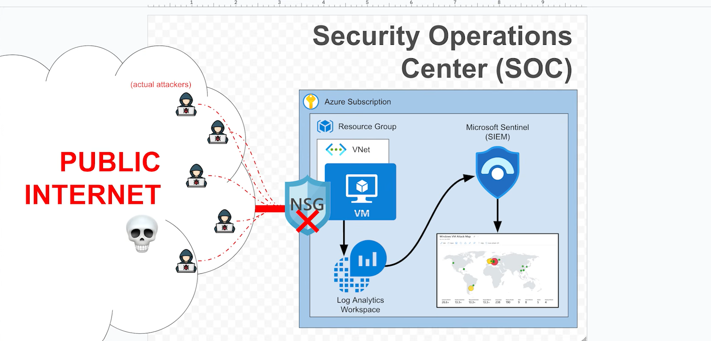
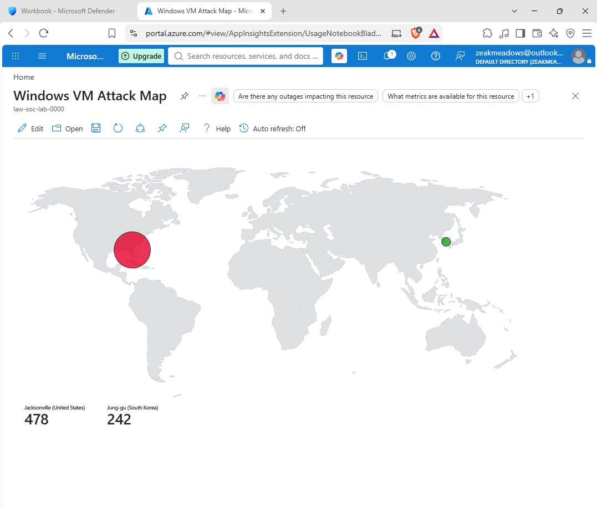

# Microsoft Sentinel SIEM Lab — Brute Force Detection & GeoIP Attack Map

A self-built Security Operations Center (SOC) lab using **Microsoft Sentinel**
and the broader **Microsoft security stack** to detect, enrich, and visualize
brute-force login attempts against an exposed VM in near real time.

## Microsoft Tools Used

| Tool | Role |
|---|---|
| **Microsoft Sentinel** | Cloud-native SIEM — detection logic, workbooks, alerting |
| **Microsoft Defender XDR portal** | Unified security operations console (Sentinel + XDR surfaces) |
| **Log Analytics Workspace** | Log ingestion & KQL query engine |
| **Azure Monitor Workbooks** | Custom attack-map visualization |
| **KQL (Kusto Query Language)** | Detection query authoring, GeoIP enrichment |
| **Sentinel Watchlists** | GeoIP CIDR lookup table for `ipv4_lookup()` |
| **Azure NSG** | Network security boundary / controlled attack surface |
| **Azure VNet** | Isolated network for the target VM |

## Architecture

> **Note:** This lab was built and operated entirely through the unified
> **Microsoft Defender XDR portal**, where Microsoft Sentinel now lives
> alongside Defender for Endpoint, Identity, and Cloud Apps in a single
> console — reflecting Microsoft's current converged SecOps architecture.



**Flow:**
1. A VM sits behind an NSG in an Azure VNet, deliberately exposed to capture
   real inbound connection attempts from the public internet.
2. Windows Security Events (EventID 4625 — failed logon) are collected into a
   **Log Analytics Workspace**.
3. **Microsoft Sentinel**, acting as the SIEM, runs a custom KQL detection query
   that enriches failed login source IPs with geolocation data via a Sentinel
   watchlist.
4. Results render on a live **Sentinel workbook attack map**, showing attacker
   origin, volume, and location as it happens.

## Detection Query (KQL — run in Microsoft Sentinel)

```kql
let GeoIPDB_FULL = _GetWatchlist("geoip");
let WindowsEvents = SecurityEvent;
WindowsEvents
| where EventID == 4625
| evaluate ipv4_lookup(GeoIPDB_FULL, IpAddress, network)
| summarize FailureCount = count() by IpAddress, latitude, longitude, cityname, countryname
| project FailureCount, AttackerIp = IpAddress, latitude, longitude,
    city = cityname, country = countryname,
    friendly_location = strcat(cityname, " (", countryname, ")")
```

Built and tested directly in Sentinel's Logs blade, then wired into a workbook
`type: 3` KQL item with a `map` visualization for live geospatial display.

## Result



Real inbound brute-force traffic captured and geolocated in **Microsoft Sentinel**
within hours of deployment — sourced from Jacksonville, US and Jung-gu,
South Korea.

## Skills Demonstrated

- **SIEM operations**: log ingestion, detection query design, workbook/dashboard
  building in Microsoft Sentinel
- **KQL**: joins, aggregation, watchlist-based enrichment (`ipv4_lookup`)
- **Microsoft Defender / Sentinel workbook JSON schema**: authoring custom
  visualizations via the Advanced Editor
- **Network security fundamentals**: NSG rule design, controlled exposure for
  attack-surface labs
- **GeoIP threat enrichment** patterns used in real SOC dashboards

## Repository Structure
microsoft-sentinel-siem-lab/
├── README.md
├── architecture.png
├── attack-map.png
├── queries/
│ └── failed-logon-geoip.kql
└── workbook/
└── attack-map-workbook.json


## Next Steps

- [ ] Sentinel analytics rule + alert on failure-count threshold
- [ ] Automated response via Logic Apps (auto-block via NSG)
- [ ] Extend to Microsoft Defender for Endpoint telemetry (DeviceLogonEvents)
- [ ] Add MITRE ATT&CK mapping to the analytics rule
